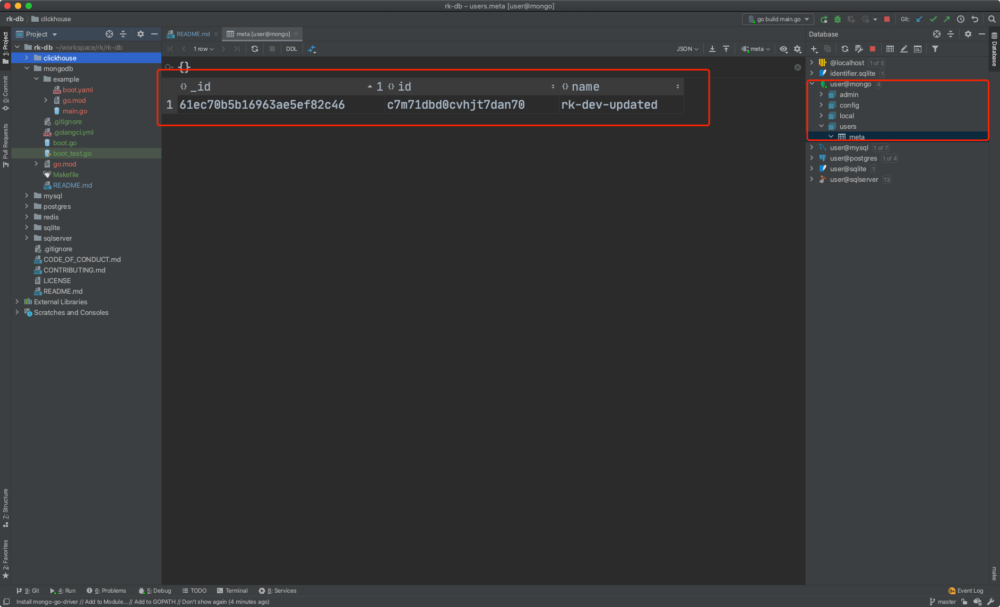

# rk-db/mongodb

Init [mongo-go-driver](https://github.com/mongodb/mongo-go-driver) from YAML config.

This belongs to [rk-boot](https://github.com/rookie-ninja/rk-boot) family. We suggest use this lib from [rk-boot](https://github.com/rookie-ninja/rk-boot).

## Supported bootstrap
| Bootstrap  | Description                                                                   |
|------------|-------------------------------------------------------------------------------|
| YAML based | Start [mongo-go-driver](https://github.com/mongodb/mongo-go-driver) from YAML |
| Code based | Start [mongo-go-driver](https://github.com/mongodb/mongo-go-driver) from code |

## Supported Instances
All instances could be configured via YAML or Code.

**User can enable anyone of those as needed! No mandatory binding!**

| Instance       | Description                                                                            |
|----------------|----------------------------------------------------------------------------------------|
| mongo.Client   | Compatible with original [mongo-go-driver](https://github.com/mongodb/mongo-go-driver) |
| mongo.Database | Compatible with original [mongo-go-driver](https://github.com/mongodb/mongo-go-driver) |

## Installation
- rk-boot: Bootstrapper base
- rk-gin: Bootstrapper for [gin-gonic/gin](https://github.com/gin-gonic/gin) Web Framework for API
- rk-db/mongo: Bootstrapper for [gorm](https://github.com/go-gorm/gorm) of mongoDB

```
go get github.com/rookie-ninja/rk-boot/v2
go get github.com/rookie-ninja/rk-gin/v2
go get github.com/rookie-ninja/rk-db/mongo
```

## Quick Start
In the bellow example, we will run ClickHouse locally and implement API of Create/List/Get/Update/Delete for User model with Gin.

- GET /v1/user, List users
- GET /v1/user/:id, Get user
- PUT /v1/user, Create user
- POST /v1/user/:id, Update user
- DELETE /v1/user/:id, Delete user

Please refer example at [example](example).

### 1.Create boot.yaml
[boot.yaml](example/boot.yaml)

- Create web server with Gin framework at port 8080
- Create MongoDB entry which connects MongoDB at localhost:27017

```yaml
---
gin:
  - name: user-service
    port: 8080
    enabled: true
mongo:
  - name: "my-mongo"                            # Required
    enabled: true                               # Required
    simpleURI: "mongodb://localhost:27017"      # Required
    database:
      - name: "users"                           # Required
```

### 2.Create main.go

In the main() function, we implement bellow things.

- Register APIs into Gin router.

```go
package main

import (
	"context"
	"encoding/json"
	"fmt"
	"github.com/gin-gonic/gin"
	"github.com/rookie-ninja/rk-boot/v2"
	"github.com/rookie-ninja/rk-db/mongodb"
	"github.com/rookie-ninja/rk-gin/v2/boot"
	"github.com/rs/xid"
	"go.mongodb.org/mongo-driver/bson"
	"go.mongodb.org/mongo-driver/mongo"
	"go.mongodb.org/mongo-driver/mongo/options"
	"net/http"
)

var (
	userCollection *mongo.Collection
)

func createCollection(db *mongo.Database, name string) {
	opts := options.CreateCollection()
	err := db.CreateCollection(context.TODO(), name, opts)
	if err != nil {
		fmt.Println("collection exists may be, continue")
	}
}

func main() {
	boot := rkboot.NewBoot()

	boot.Bootstrap(context.TODO())

	// Auto migrate database and init global userDb variable
	db := rkmongo.GetMongoDB("my-mongo", "users")
	createCollection(db, "meta")

	userCollection = db.Collection("meta")

	// Register APIs
	ginEntry := rkgin.GetGinEntry("user-service")
	ginEntry.Router.GET("/v1/user", ListUsers)
	ginEntry.Router.GET("/v1/user/:id", GetUser)
	ginEntry.Router.PUT("/v1/user", CreateUser)
	ginEntry.Router.POST("/v1/user/:id", UpdateUser)
	ginEntry.Router.DELETE("/v1/user/:id", DeleteUser)

	boot.WaitForShutdownSig(context.TODO())
}

// *************************************
// *************** Model ***************
// *************************************

type User struct {
	Id   string `bson:"id" yaml:"id" json:"id"`
	Name string `bson:"name" yaml:"name" json:"name"`
}

func ListUsers(ctx *gin.Context) {
	userList := make([]*User, 0)

	cursor, err := userCollection.Find(context.Background(), bson.D{})

	if err != nil {
		ctx.JSON(http.StatusInternalServerError, err)
		return
	}

	if err = cursor.All(context.TODO(), &userList); err != nil {
		ctx.JSON(http.StatusInternalServerError, err)
		return
	}

	ctx.JSON(http.StatusOK, userList)
}

func GetUser(ctx *gin.Context) {
	res := userCollection.FindOne(context.Background(), bson.M{"id": ctx.Param("id")})

	if res.Err() != nil {
		ctx.AbortWithError(http.StatusInternalServerError, res.Err())
		return
	}

	user := &User{}
	err := res.Decode(user)
	if err != nil {
		ctx.AbortWithError(http.StatusInternalServerError, err)
		return
	}

	ctx.JSON(http.StatusOK, user)
}

func CreateUser(ctx *gin.Context) {
	user := &User{
		Id:   xid.New().String(),
		Name: ctx.Query("name"),
	}

	_, err := userCollection.InsertOne(context.Background(), user)

	if err != nil {
		ctx.JSON(http.StatusInternalServerError, err)
		return
	}

	ctx.JSON(http.StatusOK, user)
}

func UpdateUser(ctx *gin.Context) {
	uid := ctx.Param("id")

	user := &User{
		Id:   uid,
		Name: ctx.Query("name"),
	}

	res, err := userCollection.UpdateOne(context.Background(), bson.M{"id": uid}, bson.D{
		{"$set", user},
	})

	if err != nil {
		ctx.AbortWithError(http.StatusInternalServerError, err)
		return
	}

	if res.MatchedCount < 1 {
		ctx.JSON(http.StatusNotFound, "user not found")
		return
	}

	bytes, _ := json.Marshal(user)
	fmt.Println(string(bytes))

	ctx.JSON(http.StatusOK, user)
}

func DeleteUser(ctx *gin.Context) {
	res, err := userCollection.DeleteOne(context.Background(), bson.M{
		"id": ctx.Param("id"),
	})

	if err != nil {
		ctx.AbortWithError(http.StatusInternalServerError, err)
		return
	}

	if res.DeletedCount < 1 {
		ctx.JSON(http.StatusNotFound, "user not found")
		return
	}

	ctx.String(http.StatusOK, "success")
}
```

### 3.Start server

```
$ go run main.go

2022-01-23T05:06:40.432+0800    INFO    boot/gin_entry.go:596   Bootstrap ginEntry      {"eventId": "8189d34c-198a-416e-aaa1-d26f8aa48aca", "entryName": "user-service"}
------------------------------------------------------------------------
endTime=2022-01-23T05:06:40.432231+08:00
startTime=2022-01-23T05:06:40.432144+08:00
elapsedNano=87212
timezone=CST
ids={"eventId":"8189d34c-198a-416e-aaa1-d26f8aa48aca"}
app={"appName":"rk","appVersion":"","entryName":"user-service","entryType":"Gin"}
env={"arch":"amd64","az":"*","domain":"*","hostname":"lark.local","localIP":"10.8.0.6","os":"darwin","realm":"*","region":"*"}
payloads={"ginPort":8080}
error={}
counters={}
pairs={}
timing={}
remoteAddr=localhost
operation=Bootstrap
resCode=OK
eventStatus=Ended
EOE
2022-01-23T05:06:40.432+0800    INFO    mongodb/boot.go:293     Bootstrap mongoDB entry {"entryName": "my-mongo"}
2022-01-23T05:06:40.432+0800    INFO    mongodb/boot.go:297     Creating mongoDB client at [localhost:27017]
2022-01-23T05:06:40.432+0800    INFO    mongodb/boot.go:303     Creating mongoDB client at [localhost:27017] success
2022-01-23T05:06:40.432+0800    INFO    mongodb/boot.go:310     Creating database instance [users] success
```

### 4.Validation
#### 4.1 Create user
Create a user with name of rk-dev.

```shell script
$ curl -X PUT "localhost:8080/v1/user?name=rk-dev"
{"id":"c7m71dbd0cvhjt7dan70","name":"rk-dev"}
```

#### 4.1 Update user
Update user name to rk-dev-updated.

```shell script
$ curl -X POST "localhost:8080/v1/user/c7m71dbd0cvhjt7dan70?name=rk-dev-updated"
{"id":"c7m71dbd0cvhjt7dan70","name":"rk-dev-updated"}
```

#### 4.1 List users
List users.

```shell script
$ curl -X GET localhost:8080/v1/user
[{"id":"c7m71dbd0cvhjt7dan70","name":"rk-dev-updated"}]
```

#### 4.1 Get user
Get user with id=c7m71dbd0cvhjt7dan70.

```shell script
$ curl -X GET localhost:8080/v1/user/c7m71dbd0cvhjt7dan70
{"id":"c7m71dbd0cvhjt7dan70","name":"rk-dev-updated"}
```

#### 4.1 Delete user

```shell script
$ curl -X DELETE localhost:8080/v1/user/c7bjufjd0cvqfaenpqjg
success
```



## YAML Options
User can start multiple [mongo-go-driver](https://github.com/mongodb/mongo-go-driver) instances at the same time. Please make sure use different names.

TBD

### Usage of domain

```
RK use <domain> to distinguish different environment.
Variable of <locale> could be composed as form of <domain>
- domain: Stands for different environment, like dev, test, prod and so on, users can define it by themselves.
          Environment variable: DOMAIN
          Eg: prod
          Wildcard: supported

How it works?
Firstly, get environment variable named as  DOMAIN.
Secondly, compare every element in locale variable and environment variable.
If variables in locale represented as wildcard(*), we will ignore comparison step.

Example:
# let's assuming we are going to define DB address which is different based on environment.
# Then, user can distinguish DB address based on locale.
# We recommend to include locale with wildcard.
---
DB:
  - name: redis-default
    domain: "*"
    addr: "192.0.0.1:6379"
  - name: redis-in-test
    domain: "test"
    addr: "192.0.0.1:6379"
  - name: redis-in-prod
    domain: "prod"
    addr: "176.0.0.1:6379"
```